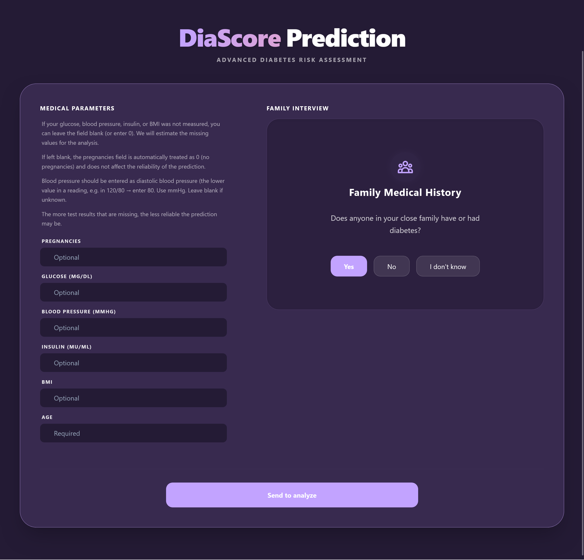
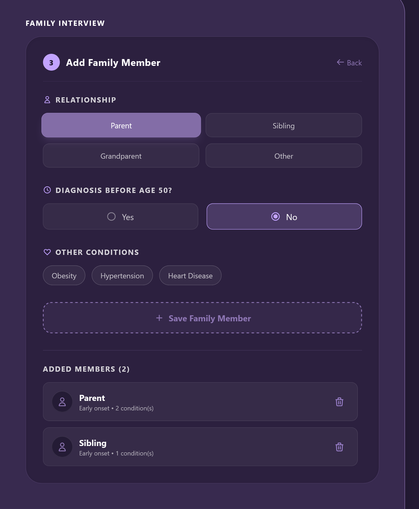
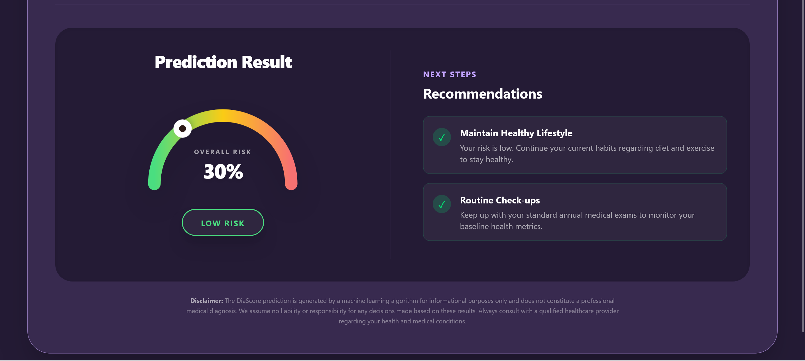
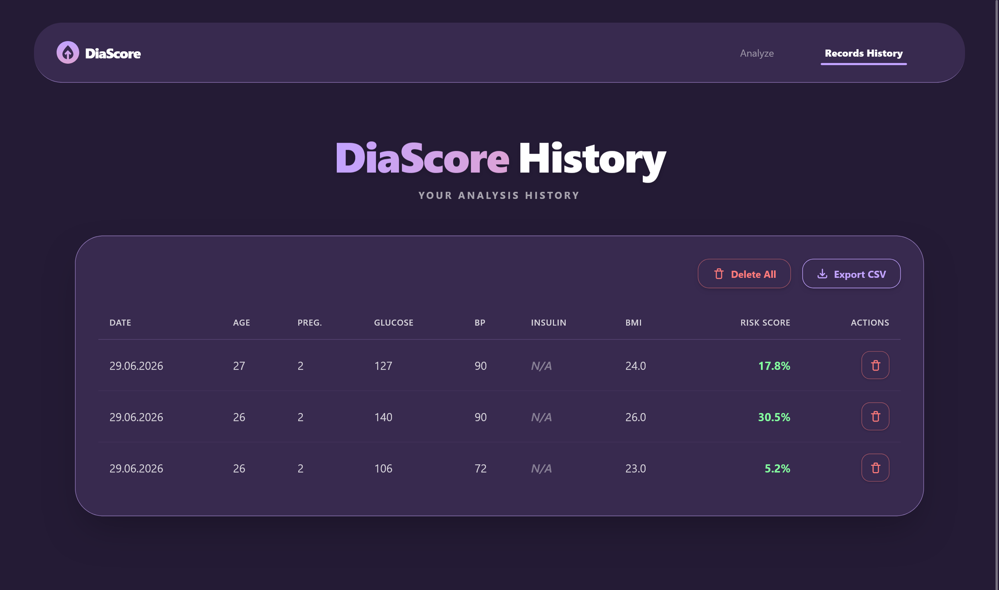
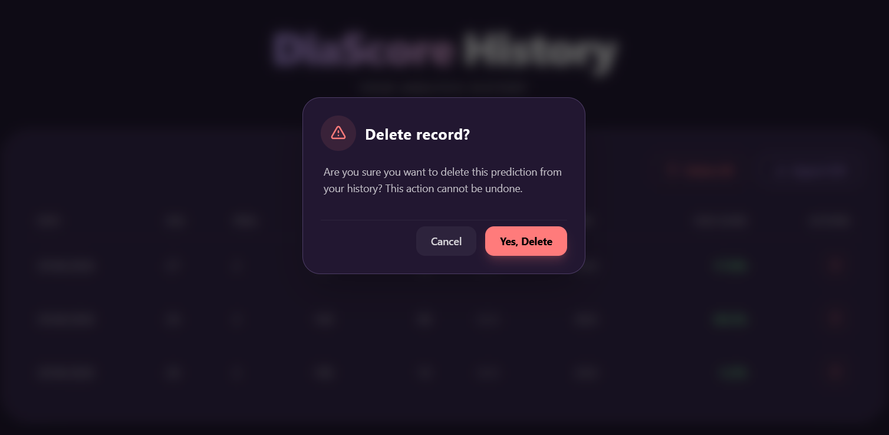

# DiaScore

[](https://www.python.org/downloads/)
[](https://fastapi.tiangolo.com/)
[](https://pytorch.org/)
[](https://scikit-learn.org/)
[](https://react.dev/)
[](https://www.sqlite.org/)

DiaScore is a full-stack application for diabetes risk estimation.
It combines:

* FastAPI API layer
* PyTorch model inference
* scikit-learn preprocessing (KNN imputer and feature scaling)
* SQLite persistence
* React + Vite frontend

## Demo and Screenshots

<p align="center">
	<video src=https://github.com/user-attachments/assets/576a9bbc-7e00-4d49-8063-608ff3042514 width="800" controls autoplay loop muted></video>
	<br>
	<em>A full demo walkthrough showing the main flow: medical questionnaire, family interview, prediction result, and history management.</em>
</p>

<p align="center">
	
	<br>
	<em>The main landing page shows the medical questionnaire on the left and the family interview card on the right. This is the entry point for entering clinical values before sending a prediction.</em>
</p>

<p align="center">
	
	<br>
	<em>The family interview screen lets the user add relatives, specify early onset diabetes, and mark associated conditions such as obesity, hypertension, or heart disease.</em>
</p>

<p align="center">
	
	<br>
	<em>The prediction result view displays the final risk percentage, risk category, and follow-up recommendations in a dedicated summary panel.</em>
</p>

<p align="center">
	
	<br>
	<em>The history screen lists previous predictions, highlights the stored clinical values, and provides export and deletion actions for managing saved records.</em>
</p>

<p align="center">
	
	<br>
	<em>The confirmation modal appears before deleting a single record or clearing history. It prevents accidental removal of stored predictions.</em>
</p>

## Project Scope

DiaScore is not only a web API. The core backend logic includes the ML model and preprocessing pipeline.
The project is built as an end-to-end system: data preparation, model training, inference, API integration, and UI for patient-facing prediction history.

## Main Features

* Predict diabetes risk from medical questionnaire values.
* Impute missing values before inference.
* Store prediction history in SQLite.
* Display history in the frontend and export results to CSV.
* Support single-record deletion and full history cleanup.

## Run with Docker

The project should be run through Docker Compose (not by starting frontend and backend separately).

### Requirements

* Docker
* Docker Compose plugin

### Build images

```bash
docker compose build
```

### Start the full stack

```bash
docker compose up
```

Or build and start in one command:

```bash
docker compose up --build
```

### Access services

* Frontend: http://localhost:3000
* API: http://localhost:8000

### Stop services

```bash
docker compose down
```

## Our Model

DiaScore uses a binary classification neural network implemented in PyTorch and trained on the Pima Indians Diabetes dataset.
Before inference, missing clinical values are imputed (KNN imputer), then scaled with StandardScaler.

Model details, intended use, metrics and trade-offs are documented in:

* [Model Card](docs/model_card.md)

Related ML notebooks:

* [Data analysis notebook](ml/notebooks/00_data_analysis.ipynb)
* [Data exploration and split notebook](ml/notebooks/01_data_exploration.ipynb)

## Project Structure

* `api/` - FastAPI app and endpoint schemas
* `database/` - SQLAlchemy models, CRUD, preprocessing, database scripts
* `frontend/` - React and Vite user interface
* `ml/` - model training, evaluation and inference code
* `data/` - dataset and split utilities
* `docs/` - project documentation, including model card

## Authors

* Patrycja Piasecka ([PatiPiasecka](https://github.com/PatiPiasecka))
* Patrycja Zborowska ([loschrix](https://github.com/loschrix))
